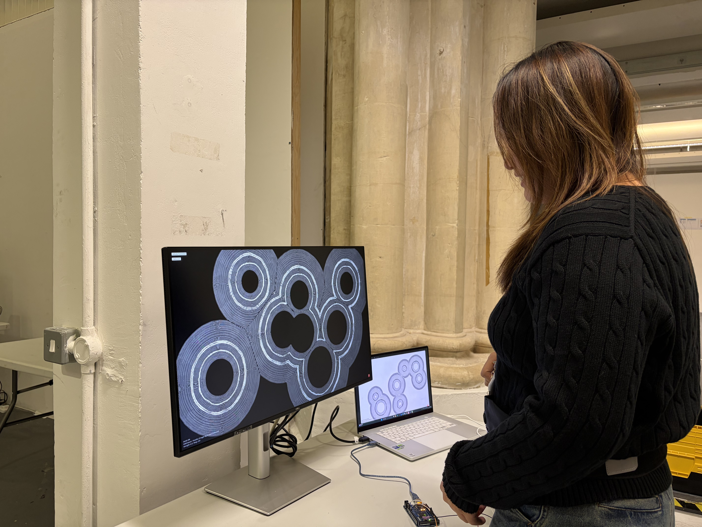
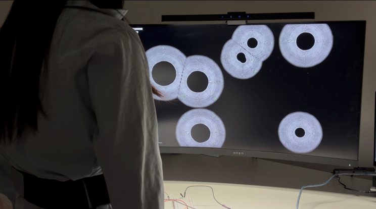
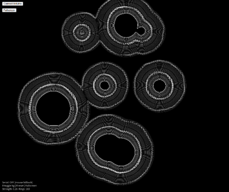
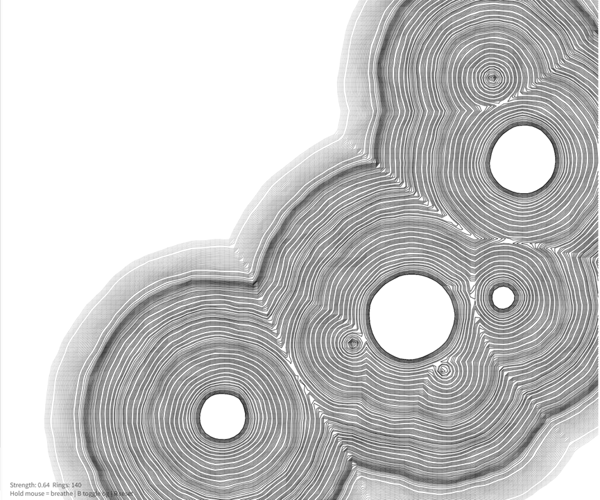

# Breath Time

**Breath Time** is an interactive computational artwork that visualises the passage of time through generative tree-ring structures controlled by human breathing.

Video documentation:  
https://vimeo.com/1153485231

---

# Installation

The project is presented as an interactive installation where viewers stand in front of a screen displaying generative ring structures. A breathing sensor worn around the abdomen captures breathing movement and sends data to the system through an Arduino.

The system translates breathing intensity into visual growth, allowing the viewer to influence the formation of rings in real time.

---

# Interaction

The artwork explores the relationship between **human breathing and the perception of time**.

Tree rings are used as a metaphor for time. In nature, tree rings slowly accumulate over years, recording the life of a tree. In this project, ring structures are continuously generated on the screen.

When no one interacts with the installation:

- rings grow slowly
- the system appears calm and stable

When breathing is detected:

- rings grow rapidly
- shapes become irregular
- breathing leaves visible traces within the structure

Keyboard controls:
B – toggle black / white background
R – reset the system
---

# Visual System

### Black background version

### White background detail

The visuals are generated using a p5.js sketch that creates layered circular lines resembling tree rings.

Breathing data is mapped to parameters such as:

- growth speed  
- ring density  
- deformation intensity  

This allows the viewer's breathing rhythm to influence the visual evolution of the structure.

---

# Hardware Requirements

To run the interactive version of the project the following hardware is required:

- Arduino microcontroller  
- Stretchable breathing belt sensor  
- Computer running a browser  
- Display screen

The breathing belt contains a stretchable rubber cord that reacts to abdominal breathing movement. The stretching of the belt produces analogue sensor values that are sent to the computer through the Arduino.

---

# Software

The project is built using:

- **p5.js**
- **JavaScript**
- **Web Serial API**
- **Arduino**

The p5.js sketch generates the visual tree-ring structures and maps breathing data to visual changes.

---

# Running the Project

To run the project locally:

1. Download or clone this repository  
2. Open `index.html` in a browser  
3. Connect Arduino if using the breathing sensor  
4. Interact with the system through breathing  

If no Arduino is connected, the project can still run in simulation mode.

---

# Files

Main project files:
index.html – main webpage
sketch.js – generative artwork code
style.css – page styling
p5.js – p5 library
p5.sound.min.js – sound library
---

# Conceptual References

Bergson, H. (1910) *Time and Free Will: An Essay on the Immediate Data of Consciousness.*

Elias, N. (1992) *Time: An Essay.*

Thích Nhất Hạnh (1990) *Breathe! You Are Alive.*

Watson, B. (1968) *The Complete Works of Chuang Tzu.*

Wu, J.C. (2014) *Daoist Meditation.*

---

# Technical References

p5.js  
https://p5js.org

Arduino  
https://www.arduino.cc

Web Serial API  
https://developer.mozilla.org/en-US/docs/Web/API/Web_Serial_API

Creative Applications Network – DendroRithms  
https://www.creativeapplications.net

---

# Author

Feiyang Zhou  
MFA Computational Arts
